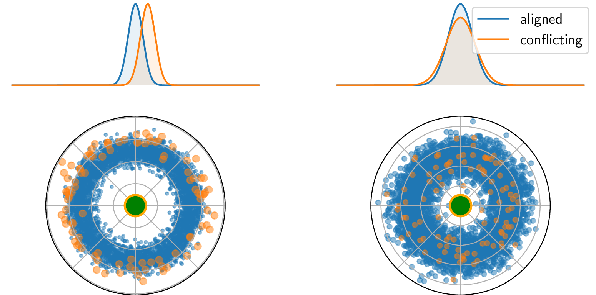

# Unbiased Supervised Contrastive Learning

Carlo Alberto Barbano<sup>1,2</sup>, Benoit Dufumier<sup>1,3</sup>, Enzo Tartaglione<sup>1</sup>, Marco Grangetto<sup>2</sup>, Pietro Gori<sup>1</sup> | [[pdf](https://arxiv.org/pdf/2211.05568.pdf)] [[poster](https://drive.google.com/file/d/10v7nNuP6zq5rPLscHBWcqQbzIh5ejBlx/view?usp=sharing)]

1<sub>LTCI, Télécom Paris, IP Paris</sub><br>
2<sub>University of Turin, Computer Science dept.</sub><br>
3<sub>NeuroSpin, CEA, Universite Paris-Saclay</sub>
<br/><br/>



Many datasets are biased, namely they contain easy-to-learn features that are highly correlated with the target class only in the dataset but not in the true underlying distribution of the data. For this reason, learning unbiased models from biased data has become a very relevant research topic in the last years. In this work, we tackle the problem of learning representations that are robust to biases. We first present a margin-based theoretical framework that allows us to clarify why recent contrastive losses (InfoNCE, SupCon, etc.) can fail when dealing with biased data. Based on that, we derive a novel formulation of the supervised contrastive loss (ϵ-SupInfoNCE), providing more accurate control of the minimal distance between positive and negative samples. Furthermore, thanks to our theoretical framework, we also propose FairKL, a new debiasing regularization loss, that works well even with extremely biased data. We validate the proposed losses on standard vision datasets including CIFAR10, CIFAR100, and ImageNet, and we assess the debiasing capability of FairKL with ϵ-SupInfoNCE, reaching state-of-the-art performance on a number of biased datasets, including real instances of biases "in the wild".

# Running


# Citing


For citing our work, please use the following bibtex entry:

```bibtex
@inproceedings{barbano2023unbiased,
    author = {Carlo Alberto Barbano and Benoit Dufumier and Enzo Tartaglione and Marco Grangetto and Pietro Gori},
    booktitle = {The Eleventh International Conference on Learning Representations },
    title = {Unbiased Supervised Contrastive Learning},
    url = {https://openreview.net/forum?id=Ph5cJSfD2XN},
    year = {2023}
}

```